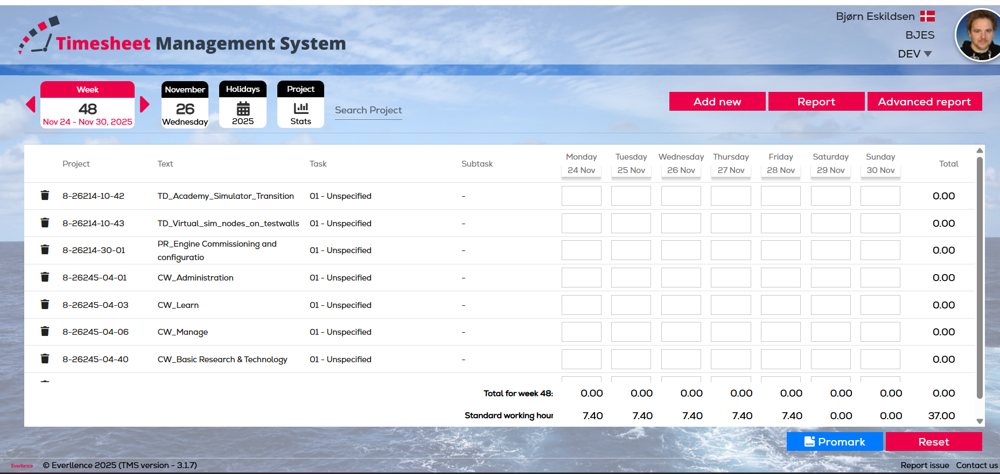

# Timesheet Bot

Automated timesheet filling for the **Timesheet Management System (TMS)** using Playwright and Python.



## Overview

This tool automates the process of filling out timesheets in the TMS web application. It reads data from CSV files and uses Playwright to interact with the web interface, filling in hours for each project and weekday.

### Features

- **CSV template generation** - Extract project list directly from TMS to get started quickly
- **GUI and CLI modes** - Choose between graphical interface or command-line automation
- **CSV-based data input** - Define your timesheet data in simple CSV format
- **Visual CSV preview** - Inspect timesheet data in a table before running (GUI mode)
- **Browser automation** - Uses Playwright for reliable web interaction
- **Manual SSO login** - Pauses for you to complete authentication
- **Multi-week support** - Fill multiple weeks automatically with a single CSV file
- **Flexible options** - Dry-run, headless mode, auto-submit, and more
- **Smart filling** - Skip empty fields, respect existing values
- **Detailed logging** - Track what's being filled and identify issues
- **Comprehensive summary** - See results with daily totals and error reporting
- **Fail-fast operation** - Stops immediately on errors to prevent partial submissions

## Prerequisites

- Python 3.8 or higher
- Access to the TMS system (https://tms.md-man.biz/home)

## Quick Setup (Windows)

For Windows users, an automated setup script is provided to quickly set up the environment:

```powershell
.\initial_setup.ps1
```

This script will:
1. Check for Python 3.8+ installation
2. Create a virtual environment
3. Install all dependencies
4. Install Playwright Chromium browser

After the script completes, activate the virtual environment and you're ready to go:

```powershell
venv\Scripts\activate
```

## Manual Installation

If you prefer manual setup or are on Linux/Mac, follow these steps:

1. **Clone or download this repository:**

   ```bash
   git clone <repository-url>
   cd TMS_auto_fill
   ```

2. **Create a virtual environment (recommended):**

   ```bash
   python -m venv venv

   # On Windows
   venv\Scripts\activate

   # On Linux/Mac
   source venv/bin/activate
   ```

3. **Install the package in development mode:**

   ```bash
   pip install -e .
   ```

4. **Install Playwright browsers:**

   ```bash
   playwright install chromium
   ```

## Getting Started

### Generate a CSV Template from TMS

The easiest way to get started is to generate a CSV template directly from your TMS timesheet page:

```bash
python -m timesheet_bot fetch_input_csv
```

**This command will:**
1. Open your browser and navigate to TMS
2. Wait for you to log in and navigate to your desired week
3. Press ENTER when ready
4. Extract all visible projects from the table
5. Generate a CSV file (`fetched_timesheet.csv`) with all project numbers and zero-filled hours

**Options:**

```bash
# Save to a specific file
python -m timesheet_bot fetch_input_csv --output my_projects.csv

# Overwrite existing file
python -m timesheet_bot fetch_input_csv --force

# Run in headless mode
python -m timesheet_bot fetch_input_csv --headless

# Verbose logging to see extraction details
python -m timesheet_bot fetch_input_csv --verbose
```

**Generated CSV format:**
```csv
project_number,project_text,task,monday,tuesday,wednesday,thursday,friday,saturday,sunday
8-26214-10-42,TD_Academy_Simulator_Transition,01 - Unspecified,0,0,0,0,0,0,0
8-26214-30-01,PR_Engine Commissioning,01 - Unspecified,0,0,0,0,0,0,0
```

**After generation:**
1. Open the generated CSV file
2. Fill in your actual hours for each day (replace the `0` values)
3. Use the `fill` command to automatically fill your timesheet

**Note:** The generated CSV uses `project_text` and `task` column names. If you want to use it with the existing CSV loader, rename these columns to `project_name` and `project_task` respectively, or simply keep them as-is since they're informational only.

### Manual CSV Creation

Alternatively, you can create your CSV file manually following the format below.

## CSV Format

The tool expects CSV files with the following format:

```csv
project_number,project_name,project_task,monday,tuesday,wednesday,thursday,friday,saturday,sunday
8-26214-10-42,TD_Academy_Simulator_Transition,01 - Unspecified,7.40,7.40,7.40,7.40,7.40,,
8-26214-30-01,PR_Engine Commissioning and configuratio,01 - Unspecified,,,,,0.30,,
8-26245-04-01,CW_Administration,01 - Unspecified,0.15,0.15,0.15,0.15,0.15,,
```

### CSV Rules

- **project_number**: Must match exactly the project number shown in TMS (e.g., `8-26214-10-42`)
- **project_name**: Project name/description (informational, not used for matching)
- **project_task**: Task description (informational, not used for matching)
- **Weekday columns**: Hours as decimal numbers (e.g., `7.40`, `1.0`, `0.5`)
- **Empty cells**: Leave blank to skip filling that day
- **Header row**: Required and must match the format above

See `data/week48.csv` for a complete example.

## Usage

### GUI Mode

The tool now includes a graphical user interface for easier operation:

**Launch the GUI:**

```bash
python -m timesheet_bot.gui
```

Or use the installed command (after `pip install -e .`):

```bash
timesheet_gui
```

**Load CSV with GUI at startup:**

```bash
python -m timesheet_bot.gui data/week48.csv
```

**GUI Features:**
- **Load CSV files** via button, drag-and-drop, or command-line argument
- **Visual CSV preview** with scrollable table showing all project data
- **Week input** accepts both formats: `48,49,50` or `48-50`
- **Validate input** (dry run) checks CSV and week syntax without opening browser
- **Run automation** opens browser in headful mode with progress dialog
- **Error handling** displays clear error messages in pop-up dialogs
- **No persistent settings** - clean slate every time

**GUI Workflow:**
1. Launch the GUI application
2. Load a CSV file (button, drag-and-drop, or CLI argument)
3. Inspect the data in the table view
4. Enter weeks to fill (e.g., `48-50`)
5. Click "Validate input" to check everything is correct
6. Click "Run" to start the automation
7. Complete SSO login when browser opens
8. Wait for completion message

### CLI Mode

For automation and scripting, use the command-line interface.

The tool provides two main commands:
- **`fetch_input_csv`** - Generate a CSV template from TMS (see Getting Started section above)
- **`fill`** - Fill timesheet from CSV data (see below)

### Basic Fill Commands

**Dry run** (validate CSV without opening browser):

```bash
python -m timesheet_bot fill --csv data/week48.csv --dry-run
```

**Fill timesheet** (default headful mode - you can see the browser):

```bash
python -m timesheet_bot fill --csv data/week48.csv
```

**Fill timesheet in headless mode** (no browser window):

```bash
python -m timesheet_bot fill --csv data/week48.csv --headless
```

**Auto-save after filling** (clicks Save button automatically):

```bash
python -m timesheet_bot fill --csv data/week48.csv --auto-submit
```

**Don't overwrite existing values**:

```bash
python -m timesheet_bot fill --csv data/week48.csv --no-overwrite
```

**Verbose logging** (for debugging):

```bash
python -m timesheet_bot fill --csv data/week48.csv --verbose
```

**Fill multiple weeks** (same CSV applied to each week):

```bash
# Fill weeks 48, 49, and 50
python -m timesheet_bot fill --csv data/week48.csv --weeks 48-50

# Fill specific weeks (48, 49, 50, and 52)
python -m timesheet_bot fill --csv data/week48.csv --weeks 48-50,52

# Fill multiple weeks and auto-save each one
python -m timesheet_bot fill --csv data/week48.csv --weeks 48-50 --auto-submit
```

### Command-Line Options

```
Options:
  --csv PATH           Path to CSV file (required)
  --week NUM           Week number 1-53 (optional)
  --year YEAR          Year e.g., 2025 (optional)
  --weeks RANGE        Week range to fill (e.g., "48-50,52" or "48,49,50")
                       Fills multiple weeks with the same CSV data
  --headless           Run browser in headless mode
  --auto-submit        Automatically click Save button after filling
                       (When used with --weeks, saves after each week)
  --no-overwrite       Skip fields that already have values
  --dry-run            Parse CSV and show plan without opening browser
  --verbose, -v        Enable verbose logging
```

## How It Works

### CSV Template Generation (`fetch_input_csv`)

1. **Launch browser** - Opens Chromium using Playwright
2. **Navigate to TMS** - Goes to the TMS URL
3. **Wait for login** - Pauses for you to complete SSO login and navigate to desired week
4. **Extract table data** - Reads all visible project rows from the timesheet table:
   - Extracts project numbers from the Project column
   - Intelligently detects project text using column names or heuristics
   - Identifies tasks using pattern matching (e.g., "01 - Unspecified")
   - Handles various table structures and column naming conventions
5. **Generate CSV** - Creates CSV file with:
   - All extracted project information
   - Zero-filled weekday columns (ready for editing)
   - Proper UTF-8 encoding
6. **Save file** - Writes to specified output path (default: `fetched_timesheet.csv`)

### Timesheet Filling (`fill`)

1. **Launch browser** - Opens Chromium using Playwright
2. **Navigate to TMS** - Goes to the TMS URL
3. **Wait for login** - Pauses and displays a prompt for you to complete SSO login manually
4. **Detect baseline week** - Automatically detects the current week displayed in TMS
5. **Process weeks** - For each week in the range (or single week if `--weeks` not specified):
   - **Navigate to week** - Uses arrow buttons to navigate to the target week
   - **Validate navigation** - Verifies the correct week is displayed (fail-fast if mismatch)
   - **Wait for table** - Ensures the timesheet table is loaded
   - **Fill data** - For each CSV row:
     - Finds the project row in the table (by project number)
     - Fills hours into the correct weekday input fields
     - Skips empty CSV cells
     - Respects `--no-overwrite` flag
   - **Optional save** - If `--auto-submit` is enabled, clicks Save button after filling the week
6. **Show summary** - Displays aggregate results including filled cells, errors, and daily totals

## Project Structure

```
TMS_auto_fill/
├── example/
│   ├── Timesheet Management System.html    # Reference HTML
│   ├── Timesheet Management System_files/  # Supporting files
│   └── tms_screenshot.png                  # Screenshot for documentation
│
├── data/
│   └── week48.csv                          # Example CSV file
│
├── timesheet_bot/
│   ├── __init__.py                         # Package initialization
│   ├── __main__.py                         # Module entry point
│   ├── cli.py                              # Command-line interface
│   ├── gui.py                              # Graphical user interface (PySide6)
│   ├── config.py                           # Configuration management
│   ├── models.py                           # Data models
│   ├── csv_loader.py                       # CSV parsing and loading
│   ├── csv_generator.py                    # CSV template generation
│   ├── playwright_client.py                # Browser automation
│   ├── selectors.py                        # DOM selectors
│   ├── week_utils.py                       # Week parsing utilities
│   ├── network_utils.py                    # Network connectivity checks
│   └── logging_utils.py                    # Logging utilities
│
├── tests/
│   ├── test_cli.py                         # CLI argument tests
│   ├── test_csv_loader.py                  # CSV loader tests
│   ├── test_csv_generator.py               # CSV generator tests
│   ├── test_dom_mapping.py                 # DOM interaction tests
│   ├── test_week_utils.py                  # Week parsing tests
│   └── test_network_utils.py               # Network utilities tests
│
├── pyproject.toml                          # Project configuration
├── initial_setup.ps1                       # Windows setup script
├── .gitignore                              # Git ignore rules
├── .env.example                            # Environment template
├── README.md                               # This file
└── Makefile                                # Common commands
```

## DOM Selectors

The tool uses Playwright selectors defined in `timesheet_bot/selectors.py`. These are based on the HTML structure saved in `example/Timesheet Management System.html`.

### Key Selectors

- **Table**: `table[mat-table]` (Angular Material table)
- **Project rows**: `tr.mat-row:has(td.cdk-column-Project:has-text("PROJECT_NUMBER"))`
- **Weekday inputs**: `input[name="monday"].dayField` (and similar for other days)
- **Save button**: `button:has-text("Save")` (appears after data entry)
- **Promark button**: `a:has-text("Promark")` (for final submission)

### Troubleshooting Selectors

If the tool fails to find elements:

1. Open the saved HTML in `example/Timesheet Management System.html`
2. Inspect the structure to see if it has changed
3. Update selectors in `timesheet_bot/selectors.py` accordingly
4. Run tests: `pytest tests/test_dom_mapping.py`

## Testing

Run the test suite:

```bash
# Install dev dependencies
pip install -e ".[dev]"

# Run all tests
pytest

# Run specific test file
pytest tests/test_csv_loader.py

# Run with verbose output
pytest -v

# Run with coverage
pytest --cov=timesheet_bot
```

## Development

### Setup Development Environment

```bash
# Install with dev dependencies
pip install -e ".[dev]"

# Install Playwright
playwright install

# Run tests
pytest
```

### Code Style

The project uses:
- **Black** for code formatting
- **Flake8** for linting
- **MyPy** for type checking (optional)

```bash
# Format code
black timesheet_bot/ tests/

# Lint
flake8 timesheet_bot/ tests/

# Type check
mypy timesheet_bot/
```

## Limitations

- **Manual login required** - The tool cannot automate SSO login (by design, for security)
- **DOM structure dependency** - If TMS updates its HTML structure, selectors may need updates
- **Project numbers must match exactly** - Including formatting, hyphens, etc.
- **Week navigation constraints** - Maximum 10 weeks forward, 20 weeks backward from baseline
- **Same CSV for all weeks** - Multi-week mode applies the same CSV data to each week
- **Fail-fast operation** - Stops immediately on any error to prevent partial/incorrect submissions
- **Browser required** - Even in headless mode, Chromium must be installed

## Troubleshooting

### Issue: fetch_input_csv extracts wrong project text
**Possible causes**:
- Table structure doesn't match expected column names
- Project text is in an unexpected cell or format

**Solution**:
- Run with `--verbose` to see which extraction strategy was used
- Check the generated CSV and verify project_text values
- The tool uses intelligent fallback strategies:
  - Strategy 1: Looks for columns with names like ProjectText, ProjectName, Description
  - Strategy 2: Identifies cells with underscores or length > 10 characters
- If extraction fails consistently, inspect the HTML structure in TMS

### Issue: CSV file not found
**Solution**: Verify the path is correct and the file exists. Use absolute paths if needed.

### Issue: Project not found in table
**Possible causes**:
- Project number doesn't match exactly (check formatting)
- Project not visible in the current week view
- Page not fully loaded

**Solution**:
- Verify project numbers in CSV match TMS exactly
- Ensure you're on the correct week in TMS before pressing ENTER
- Try running with `--verbose` for more details

### Issue: Input fields not found
**Possible causes**:
- DOM structure has changed
- Table hasn't fully loaded

**Solution**:
- Check the HTML in `example/` folder
- Update selectors in `timesheet_bot/selectors.py`
- Add a longer wait time in config

### Issue: Playwright not installed
**Error**: `playwright._impl._api_types.Error: Executable doesn't exist`

**Solution**:
```bash
playwright install chromium
```

### Issue: Values not being filled correctly
**Solution**:
- Use `--verbose` to see detailed logs
- Check if fields already have values (use `--no-overwrite` to skip them)
- Verify decimal format (use `.` not `,` for decimals)

### Issue: Week navigation failing
**Possible causes**:
- Week offset exceeds limits (+10 forward, -20 backward)
- Week navigation arrows not found in DOM
- Week display text format changed

**Solution**:
- Check the week range is within allowed bounds
- Verify you can manually navigate using the arrows in the UI
- Update selectors in `timesheet_bot/selectors.py` if DOM structure changed
- Use `--verbose` to see navigation details

### Issue: Multi-week operation stops mid-way
**Cause**: The tool uses fail-fast operation - it stops immediately on any error

**Solution**:
- Review the error message to identify which week failed
- Check if the specific week exists and is accessible in TMS
- Verify all projects exist in that week's view
- Re-run with `--verbose` to get detailed error information

## Advanced Usage

### Custom TMS URL

If your TMS instance is at a different URL, modify `timesheet_bot/config.py`:

```python
tms_url: str = "https://your-tms-instance.com/home"
```

### Timeout Configuration

Adjust timeouts in `timesheet_bot/config.py`:

```python
page_load_timeout: int = 30000  # 30 seconds
element_timeout: int = 10000    # 10 seconds
```

### Using as a Python Library

```python
from timesheet_bot import Config, load_csv, run_fill_operation

# Load CSV
rows = load_csv("data/week48.csv")

# Configure
config = Config(
    csv_path="data/week48.csv",
    headless=False,
    auto_submit=False
)

# Run
summary = run_fill_operation(config, rows)
print(summary.format_summary())
```

## Contributing

Contributions are welcome! Please:

1. Fork the repository
2. Create a feature branch
3. Make your changes
4. Add tests for new functionality
5. Ensure all tests pass
6. Submit a pull request

## License

MIT License - See LICENSE file for details

## Support

For issues, questions, or contributions:
- Open an issue on GitHub
- Check existing issues for similar problems
- Include logs when reporting bugs (use `--verbose`)

## Changelog

### Version 2.2.0 (Current)
- **NEW**: `fetch_input_csv` command to generate CSV templates directly from TMS
- **NEW**: Intelligent table extraction with fallback strategies for project text and tasks
- **NEW**: Automatic detection of project names and task descriptions from table cells
- **NEW**: Pattern-based task extraction (e.g., "01 - Unspecified", "65 - Absence")
- **NEW**: CSV template generation with zero-filled weekday columns
- **NEW**: Comprehensive test suite for CSV generation (137 tests total)
- **ENHANCED**: Project extraction now tries multiple column name variations
- **ENHANCED**: Fallback strategy looks for project text by heuristics (length, underscores)
- **IMPROVED**: Better error messages for CSV generation failures

### Version 2.1.1
- **FIXED**: Unicode encoding error on Windows (→, ✓, ✗ symbols now display correctly)
- **FIXED**: Week navigation arrow detection - now properly detects FontAwesome icon elements
- **IMPROVED**: Better error messages for week navigation failures
- **IMPROVED**: More robust arrow selector matching for different DOM structures

### Version 2.1.0
- **NEW**: PySide6 GUI for visual timesheet management
- **NEW**: Drag-and-drop CSV loading in GUI
- **NEW**: Visual CSV preview with scrollable table
- **NEW**: Validate input (dry run) button in GUI
- **NEW**: Progress dialog during automation runs
- **NEW**: Error handling with modal dialogs
- **ENHANCED**: GUI supports all week input formats (ranges and comma-separated)
- **ENHANCED**: CLI argument support for GUI (`timesheet_gui data/week48.csv`)
- **ENHANCED**: Simple command alias: `timesheet_gui` (after installation)

### Version 2.0.0
- **NEW**: Multi-week support via `--weeks` argument (e.g., `--weeks 48-50,52`)
- **NEW**: Automatic week navigation using DOM arrow buttons
- **NEW**: Baseline week detection from TMS UI
- **NEW**: Week navigation constraints (+10 forward, -20 backward)
- **NEW**: Week verification after navigation (fail-fast on mismatch)
- **CHANGED**: Auto-submit now saves after each week when using `--weeks`
- **ENHANCED**: Comprehensive logging for multi-week operations
- **ENHANCED**: Fail-fast operation stops immediately on any error

### Version 1.1.0
- **Fixed**: Page loading issue - now uses `domcontentloaded` strategy for faster navigation
- **Changed**: Auto-submit now clicks Save button instead of Promark (saves draft, doesn't submit)
- **Improved**: Save button detection with multiple fallback selectors
- **Enhanced**: Robust waiting for Save button to appear dynamically after data entry

### Version 1.0.0
- Initial release
- CSV-based timesheet filling
- Playwright browser automation
- Comprehensive test suite
- CLI interface with multiple options
- Detailed logging and error reporting
